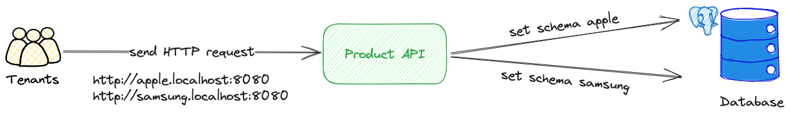
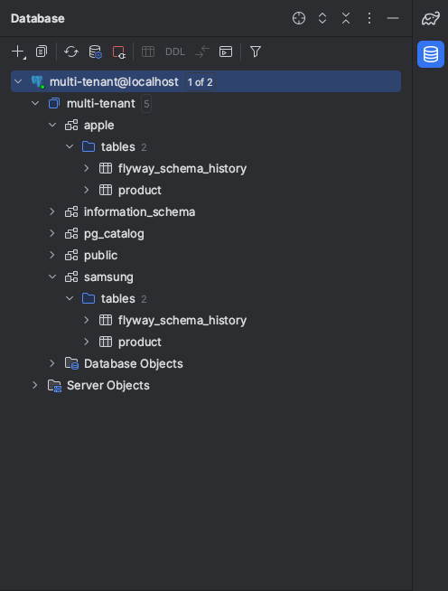
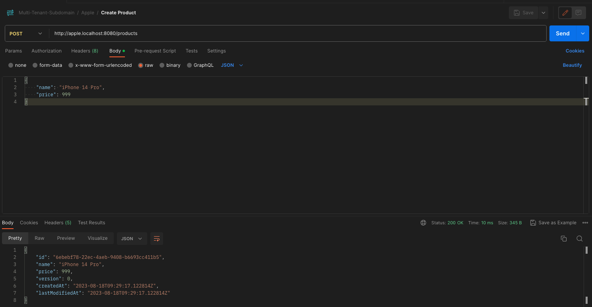
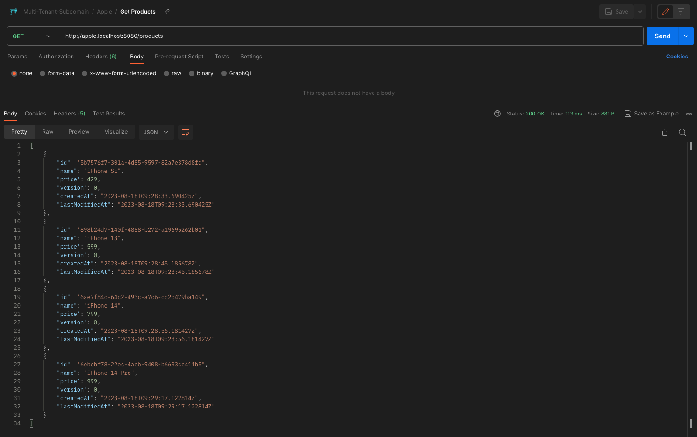
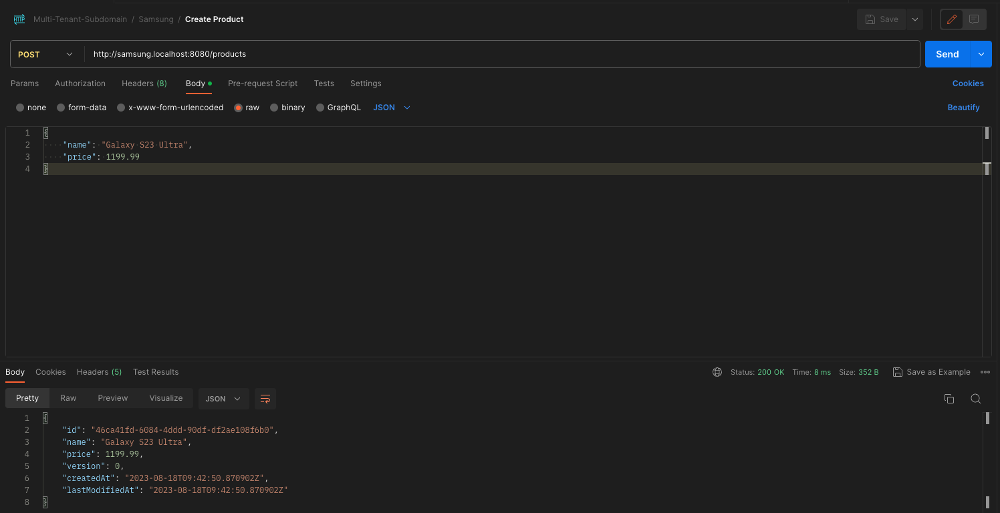
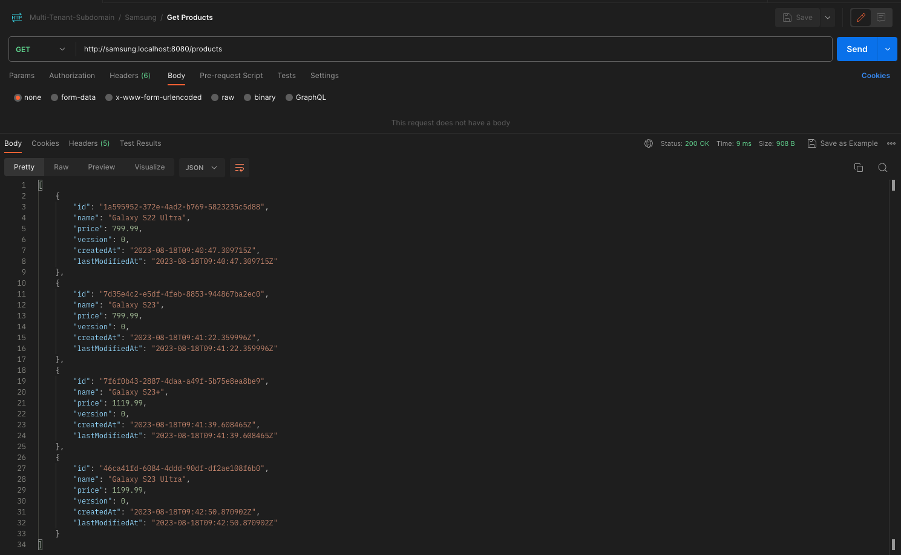
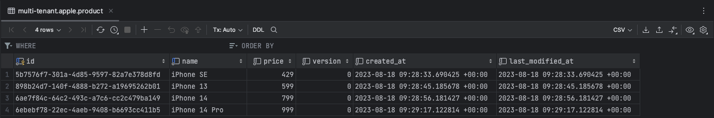
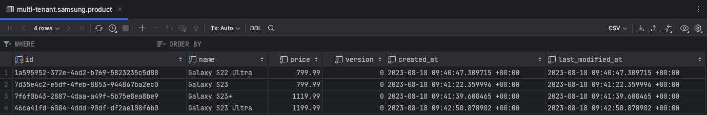

# Multi Tenancy with Spring Boot - Kotlin
## Scenario
We are a software company that offers many services. We will offer our services to multiple tenants.
The API is a very simple service where tenants can create their products and retrieve all of them.

## Architecture
All tenants will send an HTTP request to a single application. We find which tenant is sending the request via the subdomain.
You can also put the tenantId in the header instead of using the subdomain. It has been added as a comment line in the TenantFilter.kt file.

In the database, the schemas are created for each tenant (One database - Multiple Schemas). Flyway migration was used for this.

## Flyway
In the application, all tenants are retrieved from MockTenantAPI. The code was written assuming the tenant data was fetched from a service.
If you want, you can get this data by writing to a database or a yml file.

## Postman
### Apple Create Product

### Apple Get Product

### Samsung Create Product

### Samsung Get Product

## Database
### Apple Schema

### Samsung Schema
